# Git-Practical-Exam

## Task-1 Pull and Merge Difference

### Pull Request

- Pull request let you tell others about changes you have pushed to a branch. They can verify that changes and review them. After that any collaborator can merge that branch on base branch.

### Pull

- Pull is a combination of Fetch and Merge. It is used to pull changes from remote repository.

### Merge

with Merge option, one can combine two branches. There are two types of Merge.
1. Fast-Forward Merge
It is done when there is no diverged branch.

2. 3-Way Merge
It is done while we want to merge two diverged branch.

In this practical Task I created Two branches Master and Feature1/Practical1. And generated Pull Request to for the same.

```sh
 #create new branch
 git branch feature1/practical1
 #switch on that branch
 git switch feature1/practical1
 #added file1 to staging area
 git add .
 #commit changes
 git commit -m "fiel1 added for practical1"
```
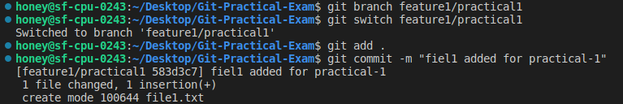

Push both the branches on Remote repository.

```sh
#push master branch (base branch for pull request)
git push origin master

#push feature1/practical1 branch
git push origin feature1/practical1 

```

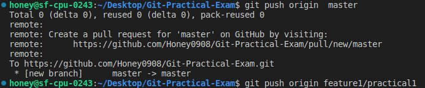

Pull Request generated in Remote repository 

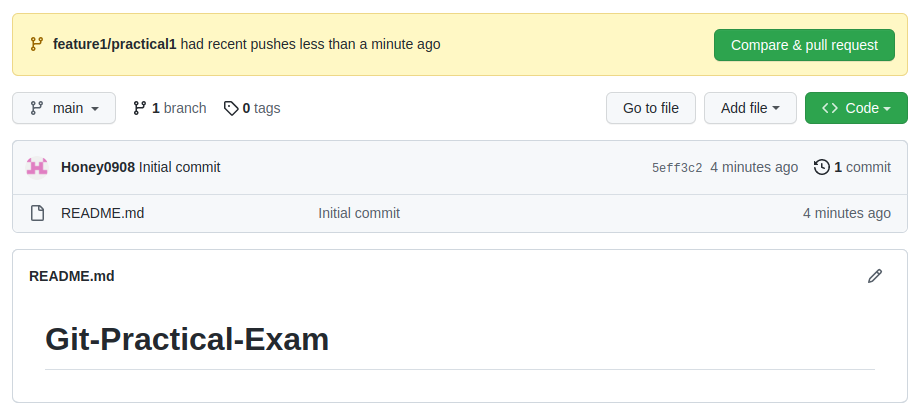
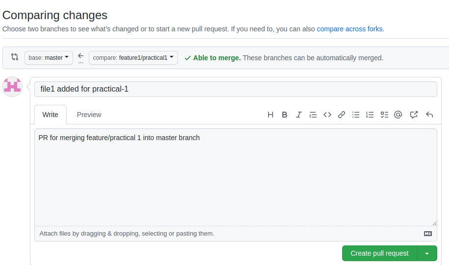
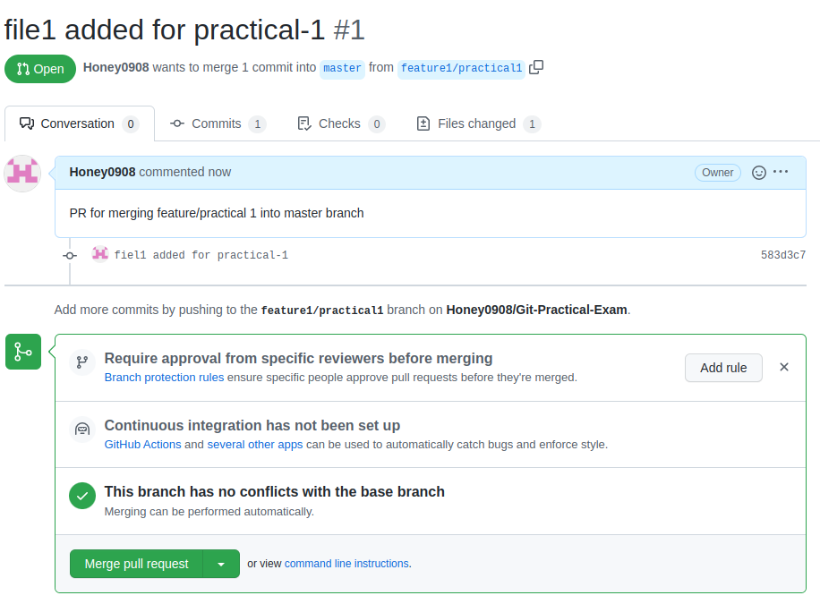
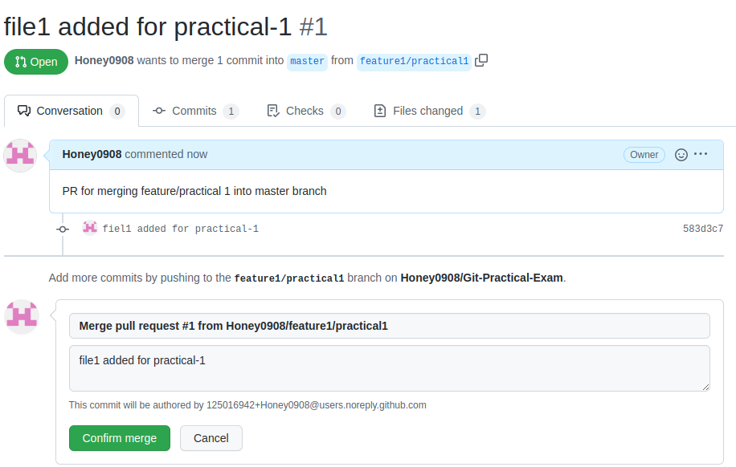

Remote Repository Scenario after Merging Banches

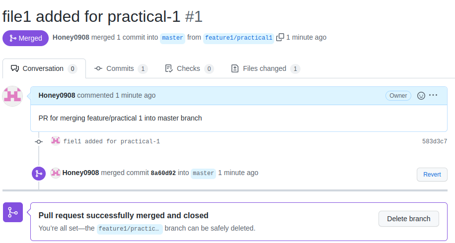

## Task-2 Rebase

- Rebase is used for bringing changes from one branch to another branch.
- Interective Rebasing is used for rewriting history in more flexible way.
- Here I've rebased feature branch with master branch

I've created feature2/practical branch for rebase operation.

```sh
#create feature2 branch
git branch feature2/practical

#make changes in master branch
#then add files to staging area
git add .

#commit changes on feature2/practical branch
git commit -m "some changes on master branch for practical task 2"

#switch to the feature2/practical branch
git switch feature2/practical
#make changes 
#added to staging area
git add .

#commit changes in feature2 branch
git commit -m "changes in feature 2 branch in practical task 2"
```
Now you can see the diverged branches

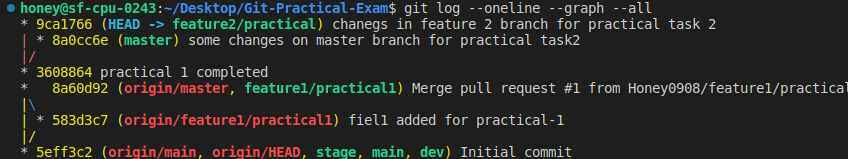

Now Switch to the feature2/practical branch and set it's base to master branch

```sh
#switch to feature2/practical branch
git switch feature2/practical

#rebase feature branch to master
git rebase master
```

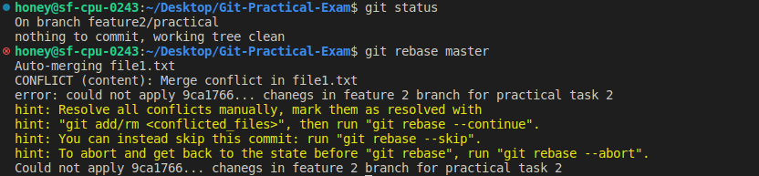


There are conflicts so first resolve the conflicts   

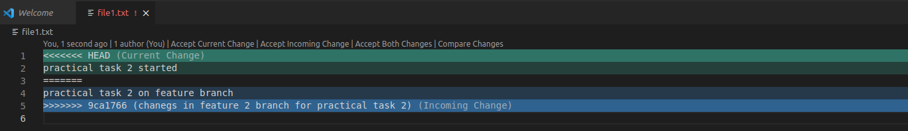

After resolving conflicts, continue rebasing

```sh
git rebase --continue
```

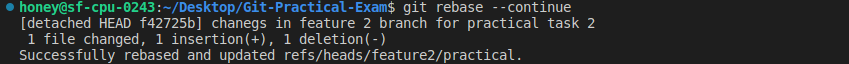

Successfully rebased. Rebase results in linear work history 


## Task-3 Change Commit Message

- Here Two methods are discribed for changing commit message

To change Previous commit message, use --amend 

```sh
#Change previous commit message by --amend
git commit --amend -m "new Commit message for practical 3"
```
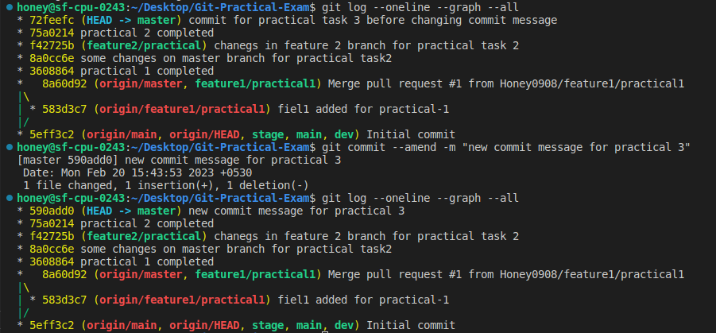

To change earlier Commits' message, Open Interective rebase and choose reword option for which you want to change message

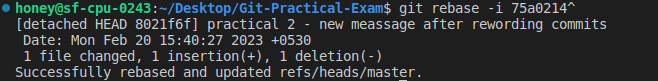

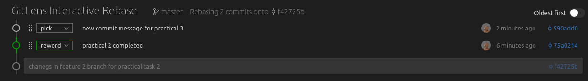

You can see the changes before and after commit messages

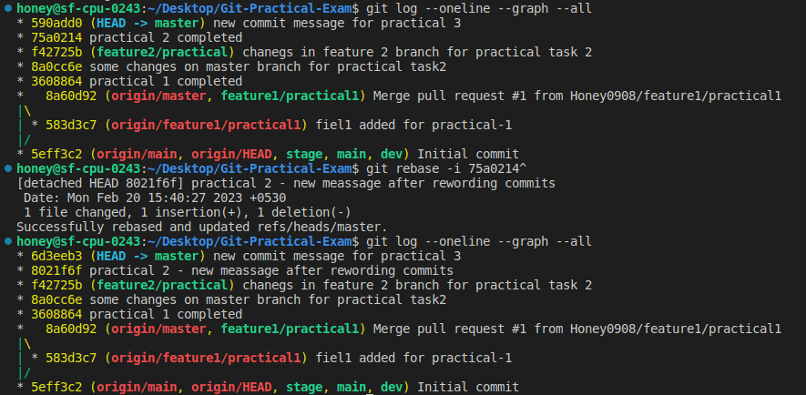


## Task-4 Cherry-Pick 

Cherry-Pick is basically used when you want some commits from other branch and not want to merge entier branch

Here New Branch was created named feature3/practical 


```sh
#created branch feature3/practical
git branch feature3/practical
#make changes and add to staging area
git add .
#commit somechanges
git commit -m "file2 created for practical task 4 in feature3"
```

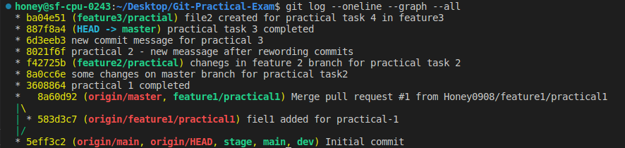

Switch to Base branch and pick commit which you want to add

```sh
#switch to master branch
git switch master

#cherry-pick commit to master branch
git cherry-pick ba04e51 
```

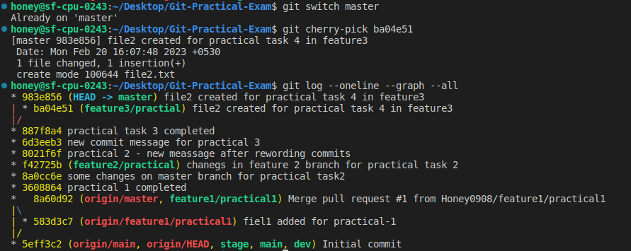


## Task-5 Drop Commits

There are two newly created commits 
change1 and change2 

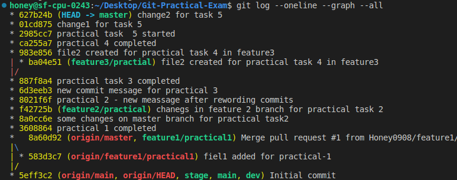

here we want to drop change 1 so enter in interective rebase mode by it's parent ID

```sh
#interective rebase mode
git rebase -i 2985cc7
```
choose drop option for which you want to delete

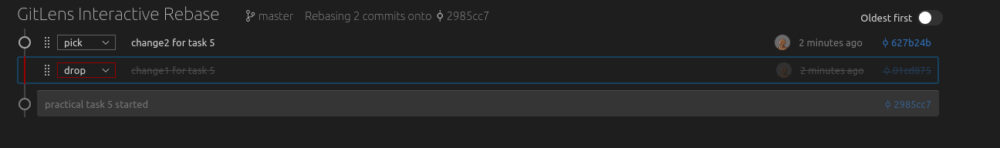

There are conflicts as File created in that commit is modified in further commits

Add those untracked or modified file
and continue with rebase operation

```sh
#continue rebasing
git rebase --continue
```

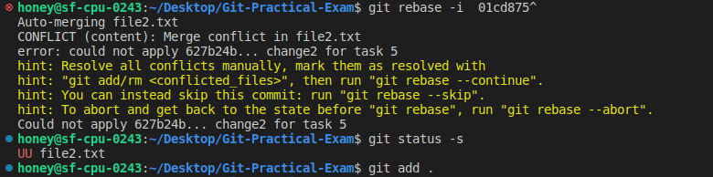


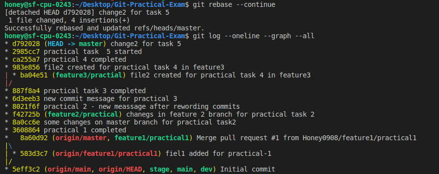


You can delete last commits by reseting it's HEAD

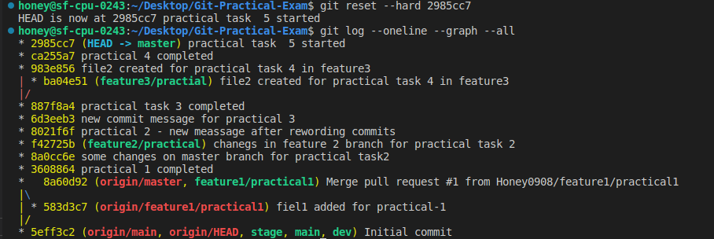

Here we are completed with Practical Task 5

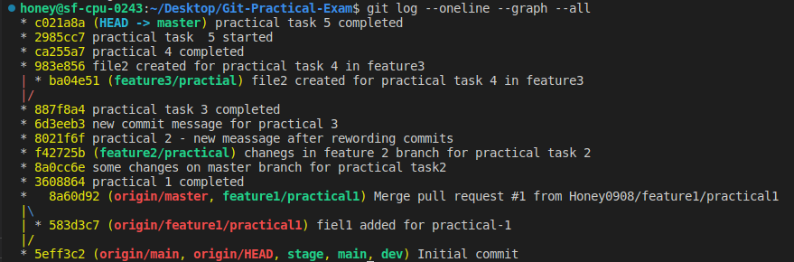